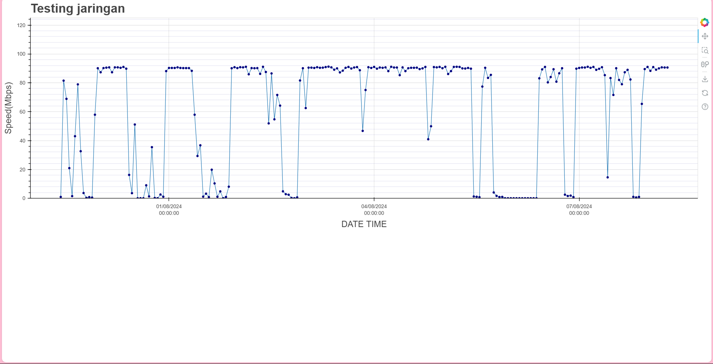
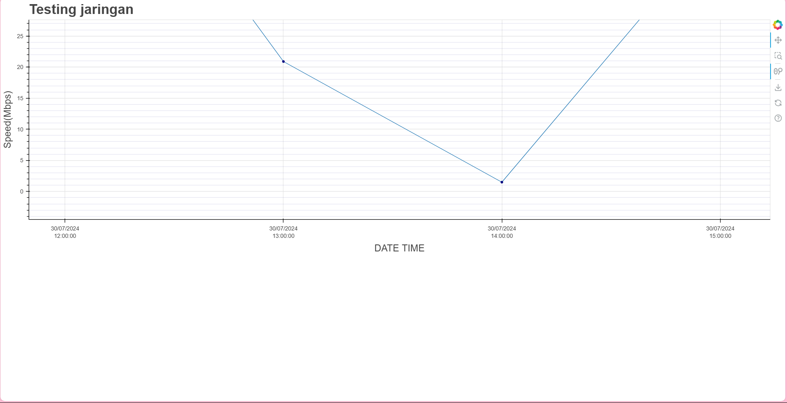

# Bokeh Line Chart

## Screenshots

### Overview



### Show Speed Request Every Hour Interval

By default the scatter is showing average speed for every one hour interval



## Get Started

### Creating Virtual Environment

```sh
python -m venv venv
```

### Enter the Virtual Environment

- Windows

```powershell
venv\Scripts\activate
```

- Linux

```bash
source venv\bin\activate
```

### Install Dependency

```bash
pip install -r requirements.txt
```

### Run The Program

```bash
python main.py
```
